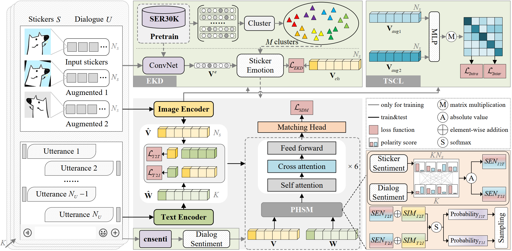

<div align="center">

# Perceive before Respond: Improving Sticker Response Selection by Emotion Distillation and Hard Mining

</div>

Pytorch training/validation code for our ACM Multimedia 2024 work.

<p align="center">

    <h4 align="center">Overview of Perceive before Respond training paradigm.</h4>
</p>


## Prerequisites

- Python >= 3.6
- Pytorch >= 1.8.0
- Install [libKMCUDA](https://github.com/src-d/kmcuda) based on your cuda version
- Others (transformers, etc.) Check requirements.txt for reference.


## Data 
1.  Please download the StickerChat dataset from [here](https://github.com/gsh199449/stickerchat) and update the `image_root` in `config/SRS.yaml`.

2. Please place the `release_train.json`, `release_val.json` and `release_test.json` files downloaded in the previous step in the `data` folder. Or directly download the `data` folder from Baidu Netdisk [here](https://pan.baidu.com/s/1AQYkYP8OgbNC8cXYsdhPSQ?pwd=wc6i). Then run `data/make_senti.py`, which saves the cnsenti sentiment analysis results for each sentence in `release_train_senti.pkl`.

3. Please download the pre-trained model weights for image encoder from [here](https://github.com/salesforce/ALBEF) and place `ALBEF.pth` in the `./weight` folder.

4. Please download the SER30K dataset from [here](https://github.com/nku-shengzheliu/SER30K). In our work, we trained 100 epochs on SER30K using the [timm](https://github.com/rwightman/pytorch-image-models) library's ResNet50, with an image resolution of 128×128, and the final classification accuracy was 64.56%. The final model weight is placed on `weights/ResNet50_SER30K.pth`

5. Using the ResNet50 from the previous step to extract features for each image in SER30K. We provide a simple script at `cluster_feats/cluster_kmeans.py` as an example to cluster the extracted features using K-Means. In our experiments, we use `cluster_feats/cluster_60.npy` as the Emotion Anchor.


## Training

```shell
python -m torch.distributed.launch --nproc_per_node=2 --use_env train.py \
--config ./configs/SRS.yaml \
--output_dir output/exp01 \
--res_checkpoint weights/ResNet50_SER30K.pth \
--vision_checkpoint weights/ALBEF.pth
```


## Evaluation

```shell
python -m torch.distributed.launch --nproc_per_node=1 --use_env train.py \
--config ./configs/SRS.yaml \
--checkpoint output/exp01/checkpoint_best.pth \
--evaluate
```


## Acknowledgement

Thanks for the work of [ALBEF](https://github.com/salesforce/ALBEF) and [SER30K](https://github.com/nku-shengzheliu/SER30K). My code is based on the implementation of them.
